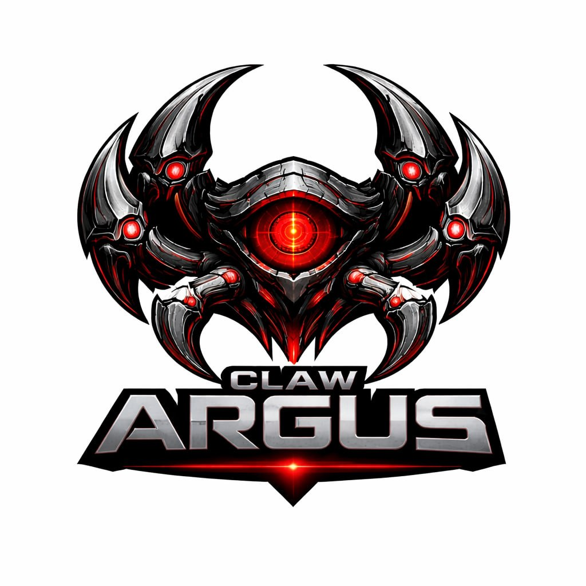

<p align="center">
  
</p>

<h1 align="center">👁️ Claw Argus</h1>

<p align="center">
  <strong>The All-Seeing Research & Intelligence System</strong>
</p>

<p align="center">
  <em>Named after Argus Panoptes — the hundred-eyed guardian of Greek mythology</em>
</p>

<p align="center">
  <a href="#-quick-start"></a>
  <a href="LICENSE"></a>
</p>

<p align="center">
  <a href="#-features">Features</a> •
  <a href="#-quick-start">Quick Start</a> •
  <a href="#-tools">Tools</a> •
  <a href="#-methodology">Methodology</a> •
  <a href="#-use-cases">Use Cases</a> •
  <a href="#-examples">Examples</a>
</p>

---

## 🧠 What is CLAW ARGUS?

**CLAW ARGUS** is an enterprise-grade, autonomous AI research agent. It performs multi-layered investigations across the web, cross-validates findings, detects bias, extracts structured entities, and generates professional intelligence reports — all autonomously.

Think of it as your personal **100-eyed research analyst** that never sleeps, never gets tired, and processes information from multiple sources simultaneously.

> 💡 **One prompt in → Comprehensive intelligence report out.**

---

## ✨ Features

<table>
<tr>
<td width="50%">

### 🔍 Multi-Engine Search
Searches across **DuckDuckGo**, **Wikipedia**, and **Wikidata** simultaneously for maximum coverage

### 🧬 Entity Extraction  
Regex-based NER pulls out **people, organizations, dates, monetary values, percentages, emails, and URLs**

### 🛡️ Bias Detection
Scans for **loaded language, hedging, absolutist claims, and emotional manipulation** in sources

</td>
<td width="50%">

### ⚖️ Cross-Validation
**Jaccard similarity** + **contradiction detection** to verify claims across multiple sources

### 📊 Deep Analysis
**Sentiment scoring, bigram extraction, readability metrics, and thematic classification** across 6 domains

### 📋 Report Generation
Structured intelligence reports with **confidence scoring, risk assessment, and exportable Markdown**

</td>
</tr>
</table>

### 🏗️ Infrastructure

- ⚡ **In-memory caching** with 5-minute TTL — no redundant API calls
- 🔄 **Retry with exponential backoff** — resilient against transient failures
- 🧩 **7 modular tools** — each independently testable and extensible
- 📦 **Minimal dependencies** — only `requests` 

---

## 🚀 Quick Start

### Prerequisites

- Python 3.10+
- An OpenAI API key (or any LLM provider)

### Installation

```bash
# Clone the repository
git clone https://github.com/ARGURAIgent/Claw-Argus.git
cd ARGURAI

# Set your API key
export OPENAI_API_KEY="your-key-here"        # Linux/Mac
set OPENAI_API_KEY=your-key-here             # Windows CMD
$env:OPENAI_API_KEY="your-key-here"          # PowerShell
```

### Run

```bash
# Run with default research task
python argus_agent.py

# Run with custom task
python argus_agent.py "Analyze the impact of AI regulations in the EU in 2025"
```

---

## 🔧 Tools

ARGUS comes equipped with **7 specialized tools** the agent invokes autonomously:

| # | Tool | Description |
|---|------|-------------|
| 1 | `web_search` | Multi-engine search across DuckDuckGo, Wikipedia, and Wikidata with caching |
| 2 | `fetch_url_content` | Deep content extraction with HTML stripping, structural analysis, and deduplication |
| 3 | `wikipedia_summary` | Dedicated Wikipedia deep-dive with categories, metadata, and reliability assessment |
| 4 | `extract_entities` | Regex-based NER: people/orgs, dates, money, percentages, emails, URLs |
| 5 | `analyze_text` | Sentiment + bias detection + bigrams + readability + thematic classification |
| 6 | `compare_sources` | Jaccard similarity, shared/unique terms, contradiction detection |
| 7 | `generate_report` | Structured reports with metadata, risks, recommendations, and Markdown export |

---

## 📐 Methodology

ARGUS follows the **DRIVAS** protocol for every research task:

```
┌─────────────┐     ┌─────────────┐     ┌─────────────┐
│  DECOMPOSE  │────▶│  RESEARCH   │────▶│  IDENTIFY   │
│ Break query │     │ Multi-engine│     │ Extract     │
│ into 3-6    │     │ search +    │     │ entities &  │
│ sub-tasks   │     │ deep fetch  │     │ key data    │
└─────────────┘     └─────────────┘     └─────────────┘
                                               │
       ┌───────────────────────────────────────┘
       ▼
┌─────────────┐     ┌─────────────┐     ┌─────────────┐
│  VALIDATE   │────▶│   ANALYZE   │────▶│ SYNTHESIZE  │
│ Cross-ref   │     │ Sentiment,  │     │ Generate    │
│ sources +   │     │ bias, and   │     │ final       │
│ detect bias │     │ themes      │     │ report      │
└─────────────┘     └─────────────┘     └─────────────┘
```

### Information Quality Hierarchy

Sources are prioritized by reliability:

```
🟢 Official/government sources    → HIGHEST
🟢 Peer-reviewed/academic         → HIGH
🟡 Established news outlets       → MEDIUM-HIGH
🟡 Wikipedia                      → MEDIUM
🟠 Industry blogs/reports         → MEDIUM
🔴 Social media/forums            → LOW
```

---

## 💼 Use Cases

### 📈 Market Research & Competitive Intelligence
Analyze competitors, market trends, and emerging opportunities. ARGUS searches 3 engines, extracts entities (companies, revenue, dates), detects bias, cross-validates findings, and generates reports with confidence scoring.

### 🛡️ Threat Intelligence & OSINT Analysis
Monitor security threats and vulnerabilities from public sources. ARGUS aggregates OSINT data, detects contradictions between sources, assesses reliability, and produces structured threat reports with recommendations.

### 📚 Academic & Technical Research
Conduct literature reviews and technical deep-dives. ARGUS decomposes research questions, gathers information from authoritative sources, validates findings, and synthesizes structured reports with full source attribution.

---

## 📝 Examples

### Basic Usage

```python
from argus_agent import argus_agent

# Run a research task
result = argus_agent.run(
    "What are the latest developments in quantum computing? "
    "Who are the key players and what are the risks?"
)

print(result)
```

### Using Individual Tools

```python
from deeprecon_agent import web_search, analyze_text, extract_entities

# Search the web
results = web_search("autonomous AI agents 2025")
print(results)

# Analyze text for sentiment and bias
analysis = analyze_text("The revolutionary AI breakthrough will transform everything...")
print(analysis)

# Extract entities from text
entities = extract_entities("OpenAI raised $6.6 billion in October 2024...")
print(entities)
```

### Sample Report Output

```json
{
  "report_metadata": {
    "report_id": "AR-4F8A2C1B3D9E",
    "title": "Autonomous AI Agents: 2025 Landscape",
    "confidence_level": "HIGH",
    "agent_version": "ARGUS v2.0.0",
    "methodology": "Multi-Source Open Intelligence (MOSINT)"
  },
  "executive_summary": "...",
  "detailed_findings": "...",
  "key_risks": ["..."],
  "recommendations": ["..."],
  "sources_consulted": ["..."],
  "markdown_export": "..."
}
```

---

## 📁 Project Structure

```
ARGURAI/
├── argus_agent.py        # Main agent implementation (all tools + agent config)
├── argus_logo.jpg    # Agent marketplace image (800×800)
├── README.md             # This file
├── LICENSE               # MIT License
└── .gitignore            # Git ignore rules
```

---

## 🤝 Contributing

Contributions are welcome! Feel free to:

1. Fork the repository
2. Create a feature branch (`git checkout -b feature/new-tool`)
3. Commit your changes (`git commit -m 'Add new tool: xyz'`)
4. Push to the branch (`git push origin feature/new-tool`)
5. Open a Pull Request

---

## 📄 License

This project is licensed under the **MIT License** — see the [LICENSE](LICENSE) file for details.

---

## 🔗 Links

---

<p align="center">
  <strong>👁️ ARGUS sees everything. You miss nothing.</strong>
</p>

<p align="center">
  <sub>Built with ❤️ by ARGUS Labs</sub>
</p>
